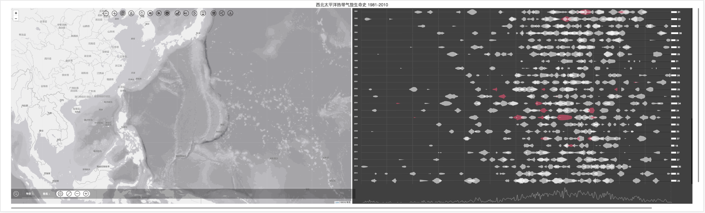

# Tropical Cyclone Information System
____

### Description  系统功能介绍
查询热带气旋的生命演变史、路径、除名情况等，结合清晰炫酷的可视化图表及地图综合进行展现。本系统由华东师范大学地理科学学院地图研究所进行界面及功能设计，由我进行系统搭建。
主要采用的技术栈为D3.js + leaflet 进行数据展示，jquery 进行交互。

### 未完成计划
1. 单个著名台风的 Map Story.
2. 图例
3. YearArea 突出显示

### 文件说明
文件包括 前端文件夹(src,component, node_modules 等), api 文件夹(TYPHOONAPI), 数据文件夹(DataProcess).
其各使用方法如下.

#### TyphoonAPI
服务端框架使用 Django Rest Framework 搭建, Django 版本为 2.0.4, Python 版本 3.6.
``` tree
Typhoon api
.
|____TyphoonApi
|____typhoon
|____tools
|____db.sqlite3
|____requirements.txt
|____convertData.py
|____getData.py
|____dumpData.py
|____readme.md
|____manage.py
|____sql
```
进入 api 文件夹, 初次运行需安装所需依赖(requirement.txt), 使用`pip3 install -r /path/to/requirements.txt` 

> 自动记录所需依赖 `pip freeze > requirements.txt`

使用` python3 manage.py runserver ` 启动 Django 服务,注意外部访问,需在最后加上` 0.0.0.0/0:80 `.数据库分为本地测试 sqlite3 数据库及腾讯云服务器建的 mysql 数据库. git 文件夹里存储有带数据的 sqlite3 数据库, 克隆之后可直接使用.

其中 getData.py, convertData.py, dumpData.py 为获取整理数据的程序. 运行 getData.py 

### 前期进展
研究D3的绘制对称面积图及leaflet绘制台风路径。

### 2017/9/7 
数据本地化

### 2017/9/16 
各年新增svg容器

### 2017/09/24
jquery outerWidth/Height 包括轮廓的宽/高
使用for循环绑定下层的事件

### 2017/9/27 
多选 bug修复;表格层和曲线图层的交互


### 2017/9/27 
添加日频数曲线

### 2017/9/29 
补充上传其他数据文件


### 2017/10/10
宽屏显示(>2000)


### 2018/4
数据库重建, 后台重建

### 2018/5
API 功能增加